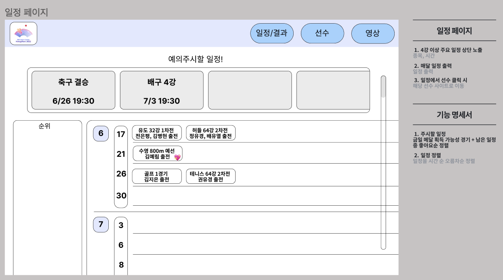
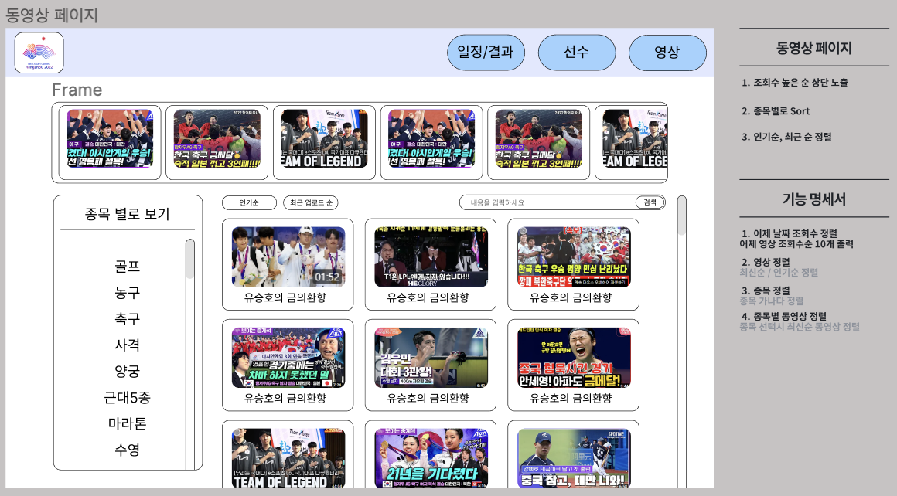

# PJT-FINAL-F-LSH-YSH
## 국제 대회 플랫폼 🌏 
- SSAFY 서울 7반 헤일리의 아픈 두 손가락  
  > 이승헌 + 유승호 
- 기간:2023.11.16 ~ 2023.11.24
 

## 🤘 헤일리의 아픈 두 손가락 🤘

<table align="center">
    <tr align="center">
        <td style="min-width: 220px;">
            <a href="https://github.com/heon118">
              
               
              <b>이승헌(팀장)</b>
            </a> 
        </td>
          <td style="min-width: 220px;">
          
            <a href="https://github.com/muyahoya">
                 
              <b>유승호</b>
            </a> 
        </td>
    </tr>
    <tr align="left">
        <td>
        🙋 백엔드 리더  
        </td>
        <td>
        🙋 프론트엔드 리더 
        </td>
    </tr>
</table>
 

## 🔍 기술 스택

### 📌 프로젝트 소개
올림픽, 아시안 게임, 월드컵 등 다양한 국제 대회가 열리는데 있어 대회의 진행 상황을 알려주는 플랫폼은 여럿 있지만 우리 선수에게 직접 응원할 수 있는 플랫폼은 없습니다. 선수들 또한 본인을 응원해주는 국민들에게 메세지를 전달할 수 있는 수단이 부족하기에 선수와 팬이 소통할 수 있는 공간을 만들었습니다.  
대회 기간 동안의 모든 일정과 결과, 관련 동영상 시청, 출전 선수와의 소통을 모두 한 사이트에서 해결할 수 있습니다.
  

### 📌 프로젝트 목표
- 웹 아키텍처 활용하여 웹 프로젝트를 설계 및 구현
- Spring Boot와 Vue의 이해
- Rest API와 VueRouter 활용
- DB 설계와 MySQL을 통한 데이터 활용
- 한 가지 이상의 API 적용
- 자신만의 아이디어를 다양한 방식으로 기획부터 구현까지 완성
  

### 📌 요구사항
- 운동 관련된 주제를 통해 Final Project를 완성한다.
- SpringBoot와 MyBatis를 활용한 RestAPI 서버를 구현한다.
- Vue3를 활용해 SPA 클라이언트를 구현한다.

 

## 🔍 기술 스택
- Java8, Spring Boot, MyBatis, MySQL, Swagger
- JavaScript, Vue3, HTML, CSS
- Git, Github
- Notion

 

## 🔍 전체 일정(wbs)

 

## 🔍 요구사항 명세서

 

## 🔍 ERD

  

 

## 🔍 화면 정의서
<table align="center">
    <tr align="center">
        <td>
        메인 페이지
        </td>
        <td>
        전체 선수 페이지
        </td>
    </tr>
    <tr align="center">
        <td style="min-width: 220px;">
              
        </td>
          <td style="min-width: 220px;">
              
        </td>
    </tr>
    <tr align="center">
        <td>
        선수 상세 페이지
        </td>
        <td>
        선수 응원 페이지
        </td>
    </tr>
    <tr align="center">
        <td style="min-width: 220px;">
              
        </td>
          <td style="min-width: 220px;">
              
        </td>
    </tr>
    <tr align="center">
        <td>
        대회 일정 페이지
        </td>
        <td>
        대회 영상 페이지
        </td>
    </tr>
    <tr align="center">
        <td style="min-width: 220px;">
              
        </td>
          <td style="min-width: 220px;">
              
        </td>
    </tr>
    <tr align="center">
        <td>
        선수 관리자 페이지
        </td>
        <td>
        관리자 페이지
        </td>
    </tr>
    <tr align="center">
        <td style="min-width: 220px;">
              
        </td>
          <td style="min-width: 220px;">
              
        </td>
    </tr>
</table>
 

## 🔍 주요 기능
🙋 대회 출전 선수와의 소통
  - 각 선수마다 개인 페이지 보유
  - 선수가 직접 한 줄 소개, 팬들에게 하고 싶은 메세지 작성 가능
  - 원하는 사진을 업로드하고 보여줄 수 있는 사진첩 기능
  - 선수에게 응원 메세지 등록 가능
  - Word Cloud API를 통한 응원 메세지 출력

📅 진행 중인 대회 일정 열람
  - 캘린더를 통한 경기 일정 제공
  - 기대되는 경기의 기대(좋아요)를 통한 기대되는 경기 일정 제공  
  - 경기 일정 열람 시 해당 경기 출전 선수 확인 가능
  - 일정 추가, 수정, 삭제(관리자)

🎬 대회 기간 중 업로드 영상 제공
  - 최신 업로드, 조회수 순 영상 목록 제공
  - 종목 선택을 통해 해당 종목에 해당하는 영상 시청 가능

 

## 🔍 실제 구현 화면

<table align="center">
    <tr align="center">
        <td>
        메인 페이지
        </td>
        <td>
        전체 선수 페이지
        </td>
    </tr>
    <tr align="center">
        <td style="min-width: 220px;">
              
        </td>
          <td style="min-width: 220px;">
              
        </td>
    </tr>
    <tr align="center">
        <td>
        선수 상세 페이지
        </td>
        <td>
        선수 응원 페이지
        </td>
    </tr>
    <tr align="center">
        <td style="min-width: 220px;">
              
        </td>
          <td style="min-width: 220px;">
              
        </td>
    </tr>
    <tr align="center">
        <td>
        대회 일정 페이지
        </td>
        <td>
        대회 영상 페이지
        </td>
    </tr>
    <tr align="center">
        <td style="min-width: 220px;">
              
        </td>
          <td style="min-width: 220px;">
              
        </td>
    </tr>
</table>
 

## ✔ 프로젝트 구조

&nbsp;📂 Spring Boot 디렉토리 구조

📦IC_Platform 
 ┣ 📂.mvn 
 ┣ 📂.settings 
 ┣ 📂src 
 ┃ ┣ 📂main 
 ┃ ┃ ┣ 📂java 
 ┃ ┃ ┃ ┣ 📂com 
 ┃ ┃ ┃ ┃ ┣ 📂shsh 
 ┃ ┃ ┃ ┃ ┃ ┣ 📂ic 
 ┃ ┃ ┃ ┃ ┃ ┃ ┣ 📂config 
 ┃ ┃ ┃ ┃ ┃ ┃ ┃ ┣ 📜DBConfig.java 
 ┃ ┃ ┃ ┃ ┃ ┃ ┃ ┣ 📜SwaggerConfig.java 
 ┃ ┃ ┃ ┃ ┃ ┃ ┃ ┗ 📜WebConfig.java 
 ┃ ┃ ┃ ┃ ┃ ┃ ┣ 📂controller 
 ┃ ┃ ┃ ┃ ┃ ┃ ┃ ┣ 📜CountryRestController.java 
 ┃ ┃ ┃ ┃ ┃ ┃ ┃ ┣ 📜EventRestController.java 
 ┃ ┃ ┃ ┃ ┃ ┃ ┃ ┣ 📜FanMsgRestController.java 
 ┃ ┃ ┃ ┃ ┃ ┃ ┃ ┣ 📜PlayerMsgRestController.java 
 ┃ ┃ ┃ ┃ ┃ ┃ ┃ ┣ 📜PlayerRestController.java 
 ┃ ┃ ┃ ┃ ┃ ┃ ┃ ┣ 📜PostRestController.java 
 ┃ ┃ ┃ ┃ ┃ ┃ ┃ ┗ 📜VideoRestController.java 
 ┃ ┃ ┃ ┃ ┃ ┃ ┣ 📂model 
 ┃ ┃ ┃ ┃ ┃ ┃ ┃ ┣ 📂dao 
 ┃ ┃ ┃ ┃ ┃ ┃ ┃ ┃ ┣ 📜CountryDao.java 
 ┃ ┃ ┃ ┃ ┃ ┃ ┃ ┃ ┣ 📜EventDao.java 
 ┃ ┃ ┃ ┃ ┃ ┃ ┃ ┃ ┣ 📜FanMsgDao.java 
 ┃ ┃ ┃ ┃ ┃ ┃ ┃ ┃ ┣ 📜PlayerDao.java 
 ┃ ┃ ┃ ┃ ┃ ┃ ┃ ┃ ┣ 📜PlayerMsgDao.java 
 ┃ ┃ ┃ ┃ ┃ ┃ ┃ ┃ ┣ 📜PostDao.java 
 ┃ ┃ ┃ ┃ ┃ ┃ ┃ ┃ ┗ 📜VideoDao.java 
 ┃ ┃ ┃ ┃ ┃ ┃ ┃ ┣ 📂dto 
 ┃ ┃ ┃ ┃ ┃ ┃ ┃ ┃ ┣ 📜Country.java 
 ┃ ┃ ┃ ┃ ┃ ┃ ┃ ┃ ┣ 📜Event.java 
 ┃ ┃ ┃ ┃ ┃ ┃ ┃ ┃ ┣ 📜FanMsg.java 
 ┃ ┃ ┃ ┃ ┃ ┃ ┃ ┃ ┣ 📜Player.java 
 ┃ ┃ ┃ ┃ ┃ ┃ ┃ ┃ ┣ 📜PlayerMsg.java 
 ┃ ┃ ┃ ┃ ┃ ┃ ┃ ┃ ┣ 📜Posts.java 
 ┃ ┃ ┃ ┃ ┃ ┃ ┃ ┃ ┗ 📜Video.java 
 ┃ ┃ ┃ ┃ ┃ ┃ ┃ ┗ 📂service 
 ┃ ┃ ┃ ┃ ┃ ┃ ┃ ┃ ┣ 📜CountryService.java 
 ┃ ┃ ┃ ┃ ┃ ┃ ┃ ┃ ┣ 📜CountryServiceImpl.java 
 ┃ ┃ ┃ ┃ ┃ ┃ ┃ ┃ ┣ 📜EventService.java 
 ┃ ┃ ┃ ┃ ┃ ┃ ┃ ┃ ┣ 📜EventServiceImpl.java 
 ┃ ┃ ┃ ┃ ┃ ┃ ┃ ┃ ┣ 📜FanMsgService.java 
 ┃ ┃ ┃ ┃ ┃ ┃ ┃ ┃ ┣ 📜FanMsgServiceImpl.java 
 ┃ ┃ ┃ ┃ ┃ ┃ ┃ ┃ ┣ 📜PlayerMsgService.java 
 ┃ ┃ ┃ ┃ ┃ ┃ ┃ ┃ ┣ 📜PlayerMsgServiceImpl.java 
 ┃ ┃ ┃ ┃ ┃ ┃ ┃ ┃ ┣ 📜PlayerService.java 
 ┃ ┃ ┃ ┃ ┃ ┃ ┃ ┃ ┣ 📜PlayerServiceImpl.java 
 ┃ ┃ ┃ ┃ ┃ ┃ ┃ ┃ ┣ 📜PostService.java 
 ┃ ┃ ┃ ┃ ┃ ┃ ┃ ┃ ┣ 📜PostServiceImpl.java 
 ┃ ┃ ┃ ┃ ┃ ┃ ┃ ┃ ┣ 📜VideoService.java 
 ┃ ┃ ┃ ┃ ┃ ┃ ┃ ┃ ┗ 📜VideoServiceImpl.java 
 ┃ ┃ ┃ ┃ ┃ ┃ ┗ 📜IcPlatformApplication.java 
 ┃ ┃ ┣ 📂resources 
 ┃ ┃ ┃ ┣ 📂mappers 
 ┃ ┃ ┃ ┃ ┣ 📜countryMapper.xml 
 ┃ ┃ ┃ ┃ ┣ 📜eventMapper.xml 
 ┃ ┃ ┃ ┃ ┣ 📜fanMsgMapper.xml 
 ┃ ┃ ┃ ┃ ┣ 📜playerMapper.xml 
 ┃ ┃ ┃ ┃ ┣ 📜playerMsgMapper.xml 
 ┃ ┃ ┃ ┃ ┣ 📜postMapper.xml 
 ┃ ┃ ┃ ┃ ┗ 📜videoMapper.xml 
 ┃ ┃ ┃ ┣ 📜application.properties 
 ┃ ┃ ┃ ┗ 📜banner.txt 
 ┗ 📜pom.xml 

 

&nbsp;📂 Vue3 디렉토리 구조

 📦PJT-FINAL-F-LSH-YSH 
  ┣📦src  
  ┃ ┣ 📂assets  
  ┃ ┣ 📂components  
  ┃ ┃ ┣ 📂player  
  ┃ ┃ ┃ ┣ 📜AdminMedal.vue  
  ┃ ┃ ┃ ┣ 📜PlayerCheer.vue  
  ┃ ┃ ┃ ┣ 📜PlayerDetail.vue  
  ┃ ┃ ┃ ┣ 📜PlayerList.vue  
  ┃ ┃ ┃ ┗ 📜testPost.vue  
  ┃ ┃ ┣ 📜Calender.vue  
  ┃ ┃ ┣ 📜VideoDetail.vue  
  ┃ ┃ ┗ 📜VideoList.vue  
  ┃ ┣ 📂router  
  ┃ ┃ ┗ 📜index.js  
  ┃ ┣ 📂stores  
  ┃ ┃ ┣ 📜countries.js  
  ┃ ┃ ┣ 📜player.js  
  ┃ ┃ ┣ 📜playerMsg.js  
  ┃ ┃ ┣ 📜postImg.js  
  ┃ ┃ ┗ 📜video.js  
  ┃ ┣ 📂views  
  ┃ ┃ ┣ 📜AdminView.vue  
  ┃ ┃ ┣ 📜CalenderView.vue  
  ┃ ┃ ┣ 📜CheerView.vue  
  ┃ ┃ ┣ 📜HomeView.vue  
  ┃ ┃ ┣ 📜PlayerView.vue  
  ┃ ┃ ┣ 📜PostView.vue  
  ┃ ┃ ┗ 📜VideoView.vue  
  ┃ ┣ 📜App.vue  
  ┗ ┗ 📜main.js  
 
